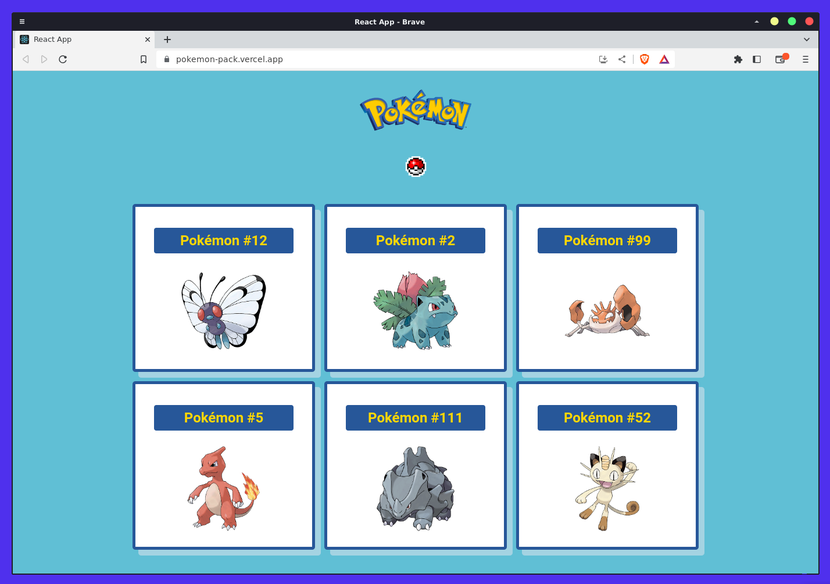

# pokemon-pack
React app that displays 6 different random Pokemon components on each refresh.



Features:

- Click the Pokeball to refresh all cards
- Click each Pokemon card to refresh only that one
- Find the golden pokemon 👀🥚

To run this project locally:

1. Clone the repository `git clone https://github.com/kaenovsky/pokemon-pack.git`
2. Go to the directory `cd pokemon-pack`
3. run `npm install`
4. Start a local server with `npm start dev`

If you want more Pokemon components on each refresh, change line 17 of `./src/Pokeball.js` to take a different 'amount' number as props:

```js
<div className="container">
    <PokemonPack amount={6} />
</div>
```

All images are taken from the PokeAPI project: https://github.com/PokeAPI

- Current deploy at Vercel: https://pokemon-pack.vercel.app/